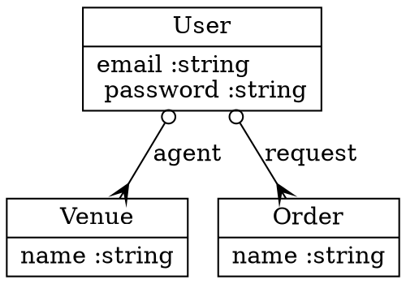

# Diagrama de Classes

Seu objetivo é escrever uma biblioteca que permita gerar um diagrama de classes a partir das classes implementadas em ruby.

Para auxiliar no desenho iremos utilizar uma biblioteca chamada [Graphviz](https://github.com/glejeune/Ruby-Graphviz).

Essa biblioteca permite que você desenhe um grafo, que é uma estrutura de dados que representa um conjunto de vértices e arestas.

O resultado pode ser facilmente visualizado em um arquivo de imagem ou pdf. 

Abaixo está um exemplo de como desenhar um diagrama de classe no formato .dot:



Sua biblioteca deve ser capaz de descobrir quais são os atributos da instância e da classe e também quais são os métodos da instância e da classe.

Os relacionamentos entre as classes devem ser declarador no código da seguinte forma:

```ruby
class Empresa
    tem_muitos Colaboradores
    tem_um Endereco
end
```

Onde `tem_muitos` e `tem_um` são métodos de classe que recebem como parâmetro o nome da classe que representa o relacionamento. Você deve construir um módulo para adicionar esses métodos e também para gerar o arquivo .dot correspondente.

O diagrama de classes deve ser gerado a partir de uma classe qualquer. A partir dessa classe todas que estiverem relacionadas devem ser descobertas e desenhadas.

A documentação completa do formato .dot pode ser encontrada [aqui](http://www.graphviz.org/doc/info/lang.html).


