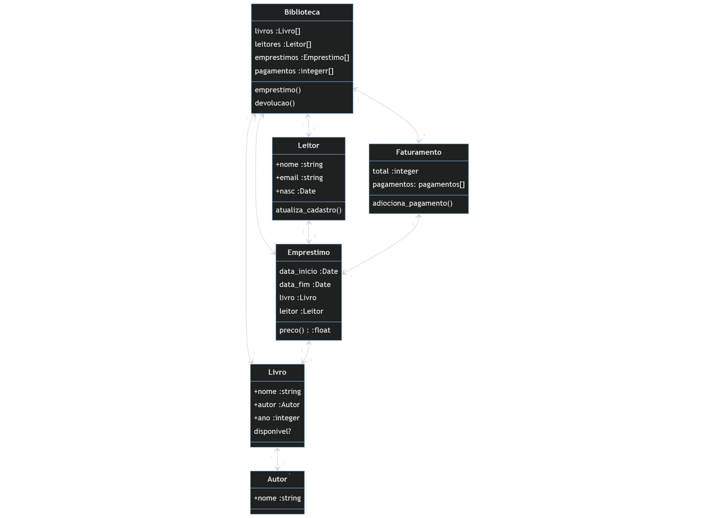
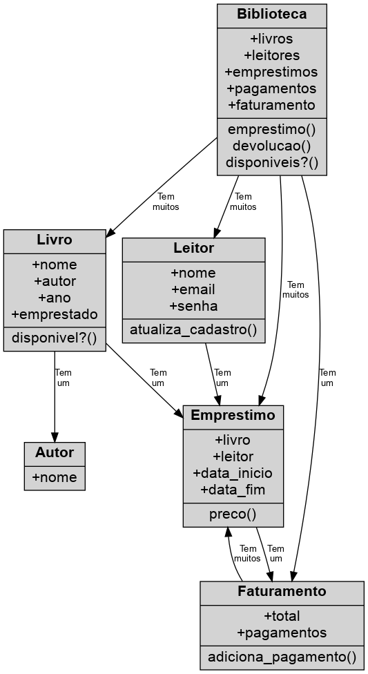
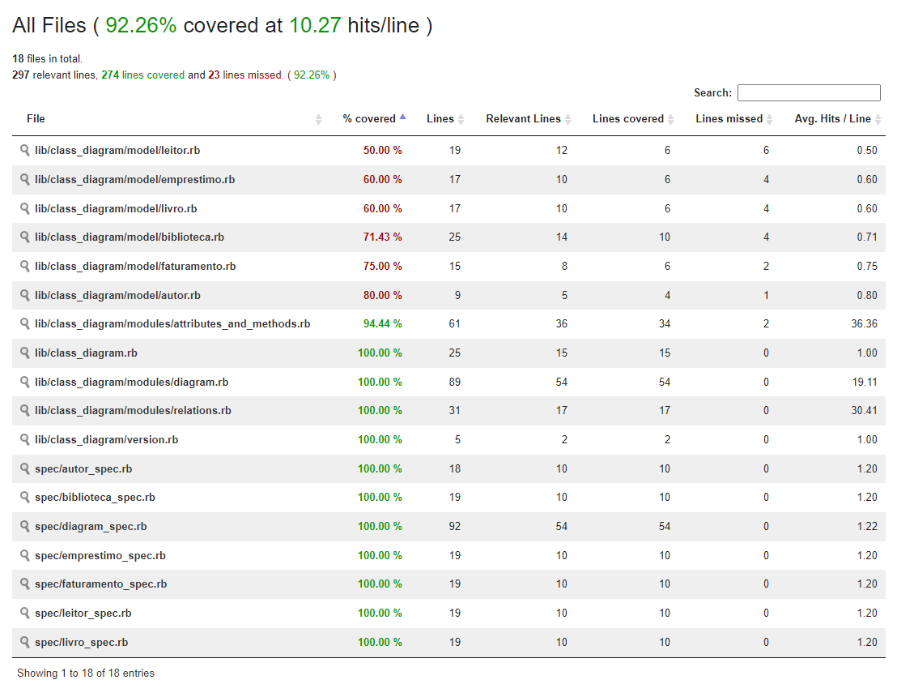

- [Biblioteca Geradora de Diagrama de Classes](#biblioteca-geradora-de-diagrama-de-classes)
  - [Projeto](#projeto)
    - [Diagrama de modelo](#diagrama-de-modelo)
  - [Objetivos](#objetivos)
  - [Considerações importantes](#considerações-importantes)
    - [Desafios na resoluções de problemas](#desafios-na-resoluções-de-problemas)
    - [Resultado obtido do modelo de teste](#resultado-obtido-do-modelo-de-teste)
      - [DOT](#dot)
      - [PNG](#png)
    - [Módulo Diagrama](#módulo-diagrama)
      - [cria_diagrama](#cria_diagrama)
      - [adiciona_no](#adiciona_no)
      - [cria_nos](#cria_nos)
      - [cria_relacionamentos](#cria_relacionamentos)
      - [cria_label #private](#cria_label-private)
    - [Módulo de Atributos e Métodos](#módulo-de-atributos-e-métodos)
      - [cria_atributos](#cria_atributos)
      - [busca_atributos](#busca_atributos)
      - [busca_metodos](#busca_metodos)
      - [adiciona_atributo](#adiciona_atributo)
      - [attr_accessor, attr_reader, attr_writer](#attr_accessor-attr_reader-attr_writer)
    - [Modulo de Relacionamento](#modulo-de-relacionamento)
      - [cria_relacionamento](#cria_relacionamento)
      - [busca_relacionamentos](#busca_relacionamentos)
      - [tem_muitos](#tem_muitos)
      - [tem_um](#tem_um)
    - [Testes](#testes)
  - [Instalação](#instalação)

# Biblioteca Geradora de Diagrama de Classes

## Projeto

Criação de uma biblioteca capaz de gerar um gráfico de diagrama de classes. O projeto foi desenvolvido com o intuito de praticar os conceitos de meta programação, _POO_ e testes unitários.

### Diagrama de modelo

Primeiro foi criado um modelo de classes como base para o projeto, passando pelos principais conceitos de diagrama de classes, tais como atributos, métodos, relação de _tem_muitos_ e _tem_um_.



[Código do diagrama](./.gitlab/diagrama.txt) feito com [mermaid](https://mermaid.live/)

## Objetivos

A missão é criar uma biblioteca capaz de ler classes implementadas no ruby e gerar um diagrama de classes em diversos formatos, a partir do código no formato `.dot`. O enunciado completo está [aqui](/.gitlab/enunciado.md). A documentacão formato `.dot` pode ser encontrada [aqui](http://www.graphviz.org/doc/info/lang.html). Condições:

- [x] Utilizar a biblioteca [Graphviz](https://github.com/glejeune/Ruby-Graphviz)
- [x] Desenhar um grafo, que é uma estrutura de dados que representa um conjunto de vértices e arestas
- [x] Visualizar em um arquivo de imagem ou pdf
- [x] Deve ser capaz de descobrir quais são os atributos da instância e da classe
- [x] Deve ser capaz de descobrir quais são os métodos da instância e da classe.
- [x] Os relacionamentos entre as classes devem ser declarados no código da seguinte forma:

  ```ruby
      class Empresa
          tem_muitos Colaboradores
          tem_um Endereco
      end
  ```

- [x] Deve construir um módulo para adicionar esses métodos
- [x] Deve construir um módulo para gerar o arquivo `.dot` correspondente.
- [x] O diagrama de classes deve ser gerado a partir de uma classe qualquer. A partir dessa classe, todas que estiverem relacionadas devem ser descobertas e desenhadas.

## Considerações importantes

### Desafios na resoluções de problemas

O primeiro desafio foi entender como o GraphViz funciona, pois não havia utilizado antes. A documentação deixa a desejar e não é tão intuitiva. Ainda assim, foi possível entender como funciona e como gerar o diagrama, através dos exemplos disponíveis no repositório.

Ter acesso as informações foi o maior desafio, pois não havia como acessar os métodos e atributos de uma instância da classe, sem instancia-la. Para isso, foi necessário criar um módulo que adiciona os métodos de relacionamentos e de atributos, para que fosse possível acessar as informações.

Lembrando que, como dito no enunciado, deveria ser gerado o gráfico a partir de uma única classe, então teria que ter uma forma recursiva para que fosse possível descobrir e acessar todas as classes relacionadas a ela.

A limitação que encontrei foi que não é possível saber os tipos de dados de cada atributo, sem instanciar a classe, então nosso diagrama não conta com essa informação. Para que isso pudesse acontecer, cada classe teria que declarar um método que passasse os tipos de dado, o que foge do proposto, já que o anunciado pede que seja feito de forma automática através da classe e não da suas instâncias.

### Resultado obtido do modelo de teste

Temos exemplos em dois formatos aqui, o `.dot` e o `.png`. O `.dot` é o código gerado que forma o gráfico, que pode ser aberto em qualquer editor de texto, já o `.png` é a imagem do gráfico. A lista de formatos que a gem GraphViz suporta pode ser encontrada [aqui](./.gitlab/output_formats.md) e na [documentação oficial](https://rubydoc.info/github/glejeune/Ruby-Graphviz/GraphViz/Constants#getAttrsFor-class_method).

#### DOT

[Diagrama em formato dot](./outputs/diagrama.dot)

#### PNG



### Módulo Diagrama

Principal módulo do projeto, responsável por gerar o diagrama de classes e agregar os demais módulos captadores de informações.

#### cria_diagrama

Método responsável por criar o diagrama de classes, utilizando a gem `ruby-graphviz` instanciando a classe GraphViz `GraphViz.new`. Com o gráfico criado, podemos utilizar ele como parâmetro para os métodos que utilizaremos posteriormente. O método também chama os métodos `cria_nos` e gera os outputs. Possui dois parâmetros: o tipo de saída desejada e o nome do arquivo.

#### adiciona_no

Método responsável apenas por adicionar o nó ao diagrama, estilizando o formato dele e adicionando o label criado no método `cria_label`.

#### cria_nos

Fica responsável por validar se um nó já foi criado e caso não tenha sido, chama a função `adiciona_no`. Caso a classe que chame esse método possua relacionamentos, deve prosseguir para o método `cria_relacionamentos`

#### cria_relacionamentos

Percorre os relacionamentos e para cada classe relacionada chama novamente o método `cria_nos` e adiciona a relação entre os nós.

#### cria_label #private

Aqui é construído a label, importando as informações dos atributos e métodos. Declarada de forma privada, pois é acessada apenas pelo método `adiciona_no`.

### Módulo de Atributos e Métodos

Módulo que agrupa os comportamentos responsáveis para lidar com o acesso aos atributos e métodos pertencentes as classes.

#### cria_atributos

Responsável por adicionar o atributo de classe `@@atributos`, caso ainda não exista, com a seguinte estrutura:

    ```ruby
        @@atributos = {
            atributos: [],
            metodos: [],
        }
    ```

#### busca_atributos

Responsável por retornar o atributo de classe `@@atributos` contendo o *hash *com as chaves `atributos` e `metodos` com seus respectivos valores sendo um array. Agrega também o resultado da `busca_metodos`.

#### busca_metodos

Responsável por retornar um array com os métodos da classe que o chama, excluindo os atributos.

#### adiciona_atributo

Adiciona os atributos da classe que o chama, guardando na _key_ `atributos` do _hash_ `@@atributos`.

#### attr_accessor, attr_reader, attr_writer

Foi necessário sobrescrever (respeitando seu funcionamento padrão) os métodos `attr_accessor`, `attr_reader` e `attr_writer` para que seja possível armazena-los no _hash_ `@@atributos`. Principalmente para ser possível diferenciar o que é atributo e o que é método, independente de ser _accessor_, _reader_ ou _writer_. Já que através dos métodos de classe, não poderíamos saber sem instancia-la. Foi utilizado o método `adiciona_atributo` e passado como parâmetro o nome do atributo.

### Modulo de Relacionamento

Módulo que agrupa os comportamentos responsáveis por relacionar as classes entre si.

#### cria_relacionamento

Cria o atributo de classe `@@relacionamento`, caso ainda não exista, com a seguinte estrutura:

    ```ruby
        @@relacionamento = {
            para_muitos: [],
            tem_um: [],
        }
    ```

#### busca_relacionamentos

Retorna o atributo de classe `@@relacionamento` contendo o _hash_ com as chaves `tem_muitos` e `tem_um` com seus valores sendo um array de classes relacionadas.

#### tem_muitos

Adiciona na classe que o chama, na _key_ `tem_muitos` do _hash_ `@@relacionamento`, a classe que foi passada como parâmetro.

#### tem_um

Adiciona na classe que o chama, na _key_ `tem_um` do _hash_ `@@relacionamento`, a classe que foi passada como parâmetro.

### Testes

Os testes foram implementados inicialmente no módulo Diagrama. Posteriormente foi estendido para os modelos que utilizei de exemplo. Testado somente os comportamentos relacionados ao diagrama, para garantir que estejam agindo conforme o esperado.

Para verificar as linhas testadas a gem [SimpleCov](https://github.com/simplecov-ruby/simplecov) auxiliou. O resultado da análise pode ser verificado [aqui](./coverage/index.html).



## Instalação

Depois de clonar o repositório entre na pasta do projeto.Execute o comando abaixo para instalar as dependências:

```bash
    bundle install
```

Execute o comando abaixo para rodar os testes:

```bash
    rspec
```

Para gerar o diagrama de classes:

- Entre no console do projeto:

```bash
    ./bin/console
```

- Execute o comando abaixo para gerar o diagrama:

```bash
    # Exemplo incluso:
    Biblioteca.gerar_diagrama
```

OBS: os outputs estarão na pasta `./outputs`

Para adicionar as suas próprias classes:

```ruby
    #Extender o Módulo Diagrama para as classes que deseja utilizar
    # Exemplo:
    class ClasseDesejada
      extend Diagrama
    end
    # Gerar o diagrama
    ClasseDesejada.gerar_diagrama
```
